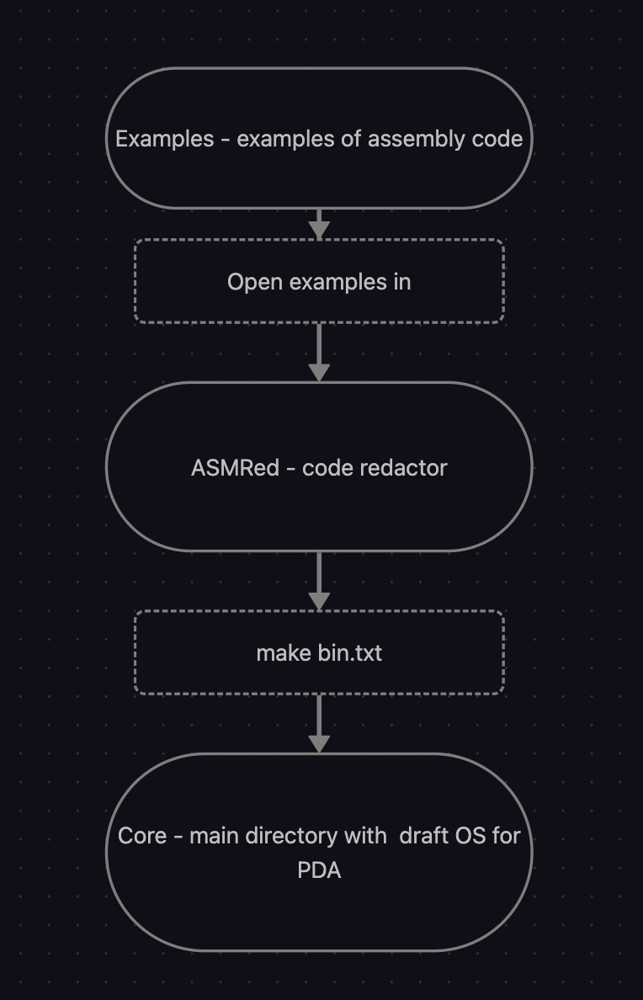

# AsmOS
This is a draft OS for PDAs on ESP32. It is planned to be able to support custom applications. The PDA will be a small computer based on ESP32 (c3, s3, c6 (most likely)). That's how it is for now.((с)Google translate).
////////////////

Это проект ОС для КПК на ESP32. Планируется возможность поддержки пользовательских приложений. КПК будет представлять из себя маленький компьютер на базе ESP32(c3, s3, c6(скорее всего)). Вот, пока так.

## Features
- **Custom applications**: Support for custom applications written in assembly(fasm).
- **File system**: Support for file system (FAT32).
- **Graphics**: Support for graphics (LCD, OLED).
- **Input/Output**: Support for input/output (buttons, LEDs, etc.).
- **Device drivers**: Support for device drivers (USB, UART, SPI, I2C).
- **Multitasking**: Support for multitasking (processes, threads).
- **Memory management**: Support for memory management (heap, stack).
- **Debugging**: Support for debugging (serial console, JTAG).

## Repo map
- **core**: AsmOS main.
- **code**: Tools for development.
- **Temp**: Temporary files.
- **examples**: Examples.
  
### Repo map in graph

